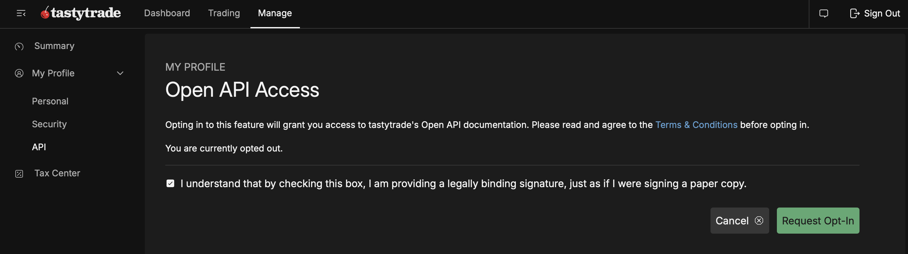
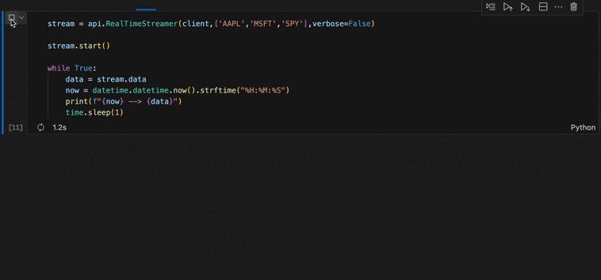

# TastyTrade-API

## Simplifying Tastytrade & DXFeed integration in Python  

This project was created to simplify the process of developing **algorithmic trading software in Python** using the [Tastytrade broker](https://developer.tastytrade.com). While Tastytrade already provides an API, it is based on `REST` requests and `WebSocket` connections, which can be difficult to integrate directly into Python workflows. In particular, the **DXFeed workflow for data streaming** requires a complex `WebSocket` setup that is not for beginners.  

This library consolidates the most common interactions into a single, lightweight Python package — including **authentication**, **historical data**, **real-time market feeds**, **order execution**, and queries for **positions** and **transactions** — providing a simpler entry point to **automated trading** and **market analysis** in Python with Tastytrade.  

## First Stepts

### Installation

Clone this repository and install the required dependencies:

```bash
git clone https://github.com/gandpablo/TastyTrade-API
cd TastyTrade-API
pip install -r requirements.txt
```
---

### Configuration

To use this library you will need your **Tastytrade credentials** (`user` and `pass`), which are simply the **email** and **password** you use to log in on the Tastytrade website.  
In the examples provided, I load them through environment variables for convenience, but you can use them directly in your code.  

---

### Enabling API Access

You must also activate the **Open API Access** in your Tastytrade account before using this library:

1. Log in to [Tastytrade](https://tastytrade.com).  
2. Navigate to **Manage → My Profile → API**.  
3. Click **`Request Opt-In`** and accept the Terms & Conditions.  
4. Once enabled, your account will display **You are currently opted in**.



---

### Session vs. Trading Account

Activating the API creates a **session**, not a full **trading account**: a session lets you query **market** and **historical data**, while for a trading account is required to **deposit funds** so yo can **place orders**, and manage **positions**. In the notebooks, only a session is used. You can have many accounts associated to the same session.


## Project Structure

```

TastyTradeAPI/
│
├── tastytrade/
│   ├── **init**.py
│   └── api.py                 # Main file: contains the TastyTradeAPI class and core methods
│
├── examples/
│   ├── example\_en.ipynb      # Jupyter Notebook in English – step-by-step usage examples
│   └── example\_es.ipynb      # Jupyter Notebook in Spanish – same examples, fully documented
│
├── requirements.txt           # Dependencies required to run the library
└── README.md

```

## Features & Examples

### 1. Login (Session)

To start, you need your Tastytrade `USER` and `PASS` (email and password).  
Once logged in, a **session** is created and you can use the API functions:

```python
from TastyTradeAPI.api import TastyTradeAPI

tt = TastyTradeAPI()
client = tt.Client(USER,PASS)
```

### 2. Account Information

You can query account details such as **balances**, **positions**, and **transactions**.  
Here is an example with the positions retrieving all of them (only one opened with AAPL):

```python
positions = tt.all_positions(client)

print(positions)
```
> **Expected output**

```json
{
  "AAPL": [
    {
      "id": "TX001",
      "transaction_type": "Buy",
      "description": "Buy to Open",
      "quantity": 100,
      "price": 150.00,
      "value": 15000.00,
      "date": "2025-09-10 14:30:00"
    }
  ]
}
```

### 3. Orders

The API allows you to send trading orders. In the example notebooks this is **fully documented**, but the main parameters are:

- `ticker` → symbol (e.g., `"AAPL"`)  
- `val` → number of shares/contracts  
- `order_type` → `"Long"` or `"Short"`  
- `action` → `"Start"` (open) or `"End"` (close)  
- `time_force` → `"Day"`, `"GTC"`, `"GTD"`, `"Ext"`  
- `otype` → `"Market"`,`"Limit"`,`"Stop"`,`"Stop Limit"` 

**Example order:**

```python
order_result = tt.order(
    Client = client,
    ticker="AAPL",
    val=10,
    order_type="Long",
    action="Start",
    time_force="Day",
    otype="Market"
)

print(order_result)
```

> **Expected output**

```json
{
  "Status": "Filled",
  "Size": 10,
  "Fees": 1.25,
  "Commission": 0.50,
  "NewBuyingPower": 9850.00,
  "ReceivedAt": "2025-09-17 14:35:00"
}
```

### 4. Real-Time Market Data

> Demo_:   

`RealTimeStreamer` opens a **persistent `WebSocket` connection** (DXFeed via Tastytrade) and runs on a **background thread**. You **poll** the latest snapshot from `stream.data` inside your own loop.  
- **What you get:** a `dict` with the latest **`askPrice`** per symbol, e.g. `{"AAPL": 238.00, "MSFT": 510.05}`.  
- **Open connection:** messages are continuous; some may be **diffuse/incomplete**, connections can **take time to open/close**, and **not all symbols update at the same time** (some can arrive slightly **delayed** vs others).  
- **Usage pattern:** start the stream, **loop** to read `stream.data`, and **stop** the stream when done.

**Parameters**
- `client` → authenticated session (created at login).  
- `tickers` → list of symbols to subscribe (e.g., `["AAPL","TSLA"]`).  
- `verbose` → `bool` (optional) for console logging.

**The data variable is the core element you will work with.**

## 5. Historical Data

Fetch **historical candles** from DXFeed (via Tastytrade) as tidy `pandas` DataFrames.  
⚠️ It can take **several seconds** (even >1 minute for many symbols) due to the DXFeed handshake and the volume of requested data.

**Parameters**
- `tickers`: symbols to fetch, e.g. `["AAPL","TSLA"]`.
- `interval`: candle size with unit:  
  - minutes: `m` (e.g., `"1m"`, `"5m"`)  
  - hours: `h` (e.g., `"1h"`)  
  - days: `d`, weeks: `w`, months: `mo`
    
- `vars`: the variables to obtain --> `["open","high","low","close","volume"]`.
- `max_data` → max number of data to request per symbol.  
  - There’s a helper (`values_from_data`) to **compute `max_data` automatically** for a target date range.

**Example**
```python
tickers  = ["AAPL", "TSLA"]
interval = "5m"
max_data = 50
vars     = ["open", "close", "volume"]

historical = tt.get_historical(client, tickers, interval, vars, max_data)
```

>**The output is a dict mapping each ticker to its DataFrame with the selected variables.**
>


